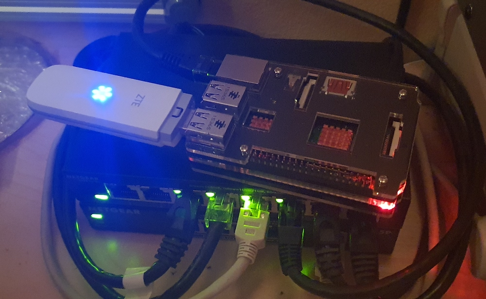

# SIM-Modem-API

The purpose of this project is to provide a high-level API to control a SIM-card modem, like the `ZTE MF-831` that I bought a long time ago. The modem has to be switched into a mode where it exposes serial devices like `/dev/ttyUSB[0-9]+`, where the number as well as what's the correct device depends on the specific model at hand. This serial device then communicates using the AT-protocol.

## Socket Server

The socket server is designed to be the absolute minimum that's required to expose the serial device (platform specific, (I couldn't even get python or node to operate on it properly on a PI)) on the network, as a well-defined socket. This socket only accepts one client at a time, as concurrent requests are to be handled on a higher level. This in-control client has to send a heartbeat message regularly in order to not be disconnected. If an error occurs during reading/writing from/to it, it is also disconnected immediately. All data sent over the socket is relayed to the serial device and all data received from the serial device is relayed over the socket.

All actions as well as all socket and serial port I/O are verbosely logged to `stdout`:

```
[15.10.2023 14:59:29] Serial device opened successfully
[15.10.2023 14:59:29] Starting serial receive loop
[15.10.2023 14:59:29] Socket server is bound and listening
[15.10.2023 14:59:40] Successfully accepted a client socket
[15.10.2023 14:59:40] Starting client receive loop
[15.10.2023 14:59:40] Successfully gave control to this client socket
[15.10.2023 14:59:40] SER_W ->AT+CMGF=1\r\n<-
[15.10.2023 14:59:40] Starting heartbeat watcher
[15.10.2023 14:59:40] SER_R ->\r\nOK\r\n<-
[15.10.2023 14:59:40] SER_W ->AT+CSCS="GSM"\r\n<-
[15.10.2023 14:59:40] SER_R ->\r\nOK\r\n<-
[15.10.2023 14:59:40] SER_W ->AT+CSCA="+4365009000000"\r\n<-
[15.10.2023 14:59:40] SER_R ->\r\nOK\r\n<-
[15.10.2023 14:59:40] SER_W ->AT+CMGS="+43123456789"\r\n<-
[15.10.2023 14:59:40] SER_R ->\r\n> <-
[15.10.2023 14:59:40] SER_W ->Hello World!\x1A\r\n<-
[15.10.2023 14:59:40] SER_R ->\r\n<-
[15.10.2023 14:59:40] SER_R ->\r\n+CMGS: 124\r\n\r\nOK\r\n<-
```

To compile, use [compile.sh](socket_server/compile.sh). A named and detached screen that also logs to a uniquely named file can be created using [start.sh](socket_server/start.sh). The [ensure_running.sh](socket_server/ensure_running.sh) script checks periodically whether the named screen is up, and if it isn't, it calls said start script. The [ensure_running.service](socket_server/ensure_running.service) is a `systemd`-service, which makes sure that [ensure_running.sh](socket_server/ensure_running.sh) is up at all times. This service can be installed by making use of [install_service.sh](socket_server/install_service.sh).

## Rest-API Server

Please read the code to find out about available endpoints, as things are rapidly changing at the moment. Documentation about these endpoints will be written eventually.

To compile, use [compile.sh](rest_api_server/compile.sh). A named and detached screen that also logs to a uniquely named file can be created using [start.sh](rest_api_server/start.sh). The [ensure_running.sh](rest_api_server/ensure_running.sh) script checks periodically whether the named screen is up, and if it isn't, it calls said start script. The [ensure_running.service](rest_api_server/ensure_running.service) is a `systemd`-service, which makes sure that [ensure_running.sh](rest_api_server/ensure_running.sh) is up at all times. This service can be installed by making use of [install_service.sh](rest_api_server/install_service.sh).

## My Setup



I'm running a `Raspberry Pi 2 Model B V1.1`, powered by an old Apple 10W USB-charger, connected to my home network over ethernet, having the modem plugged in over USB.
